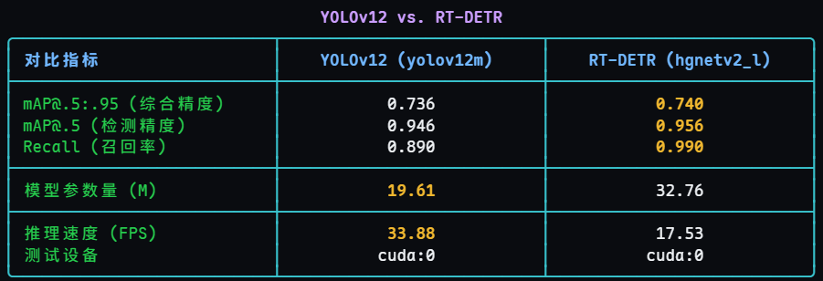
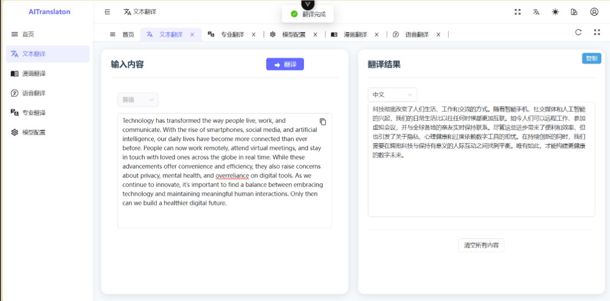
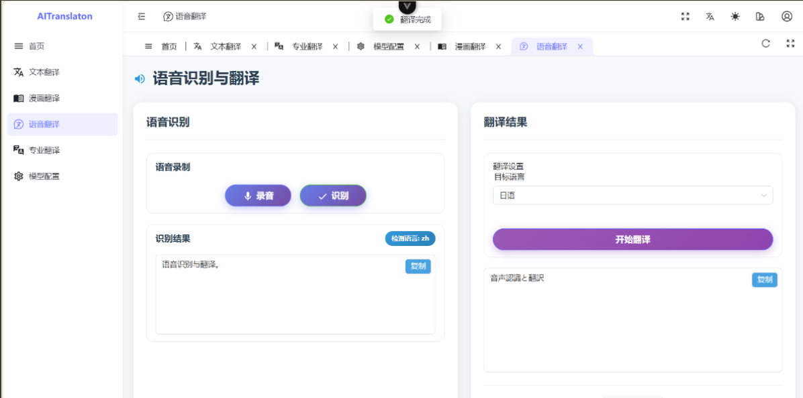
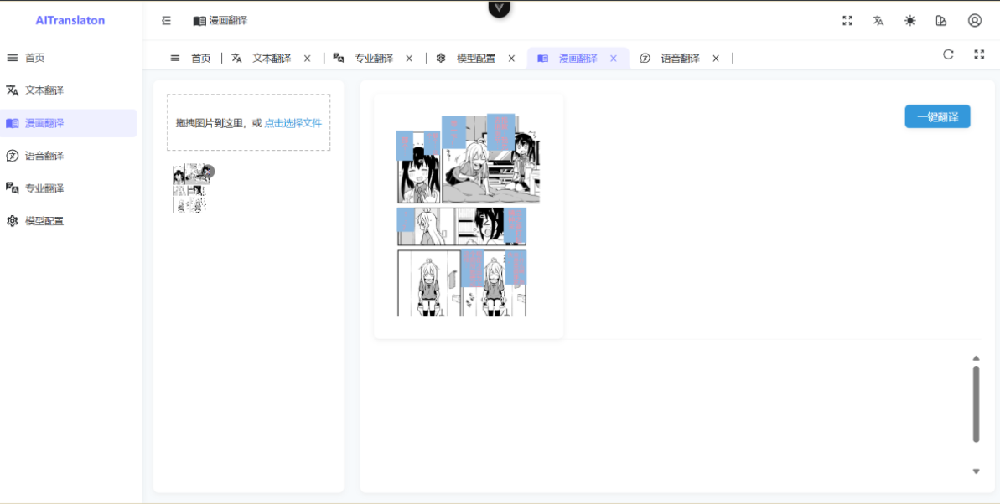
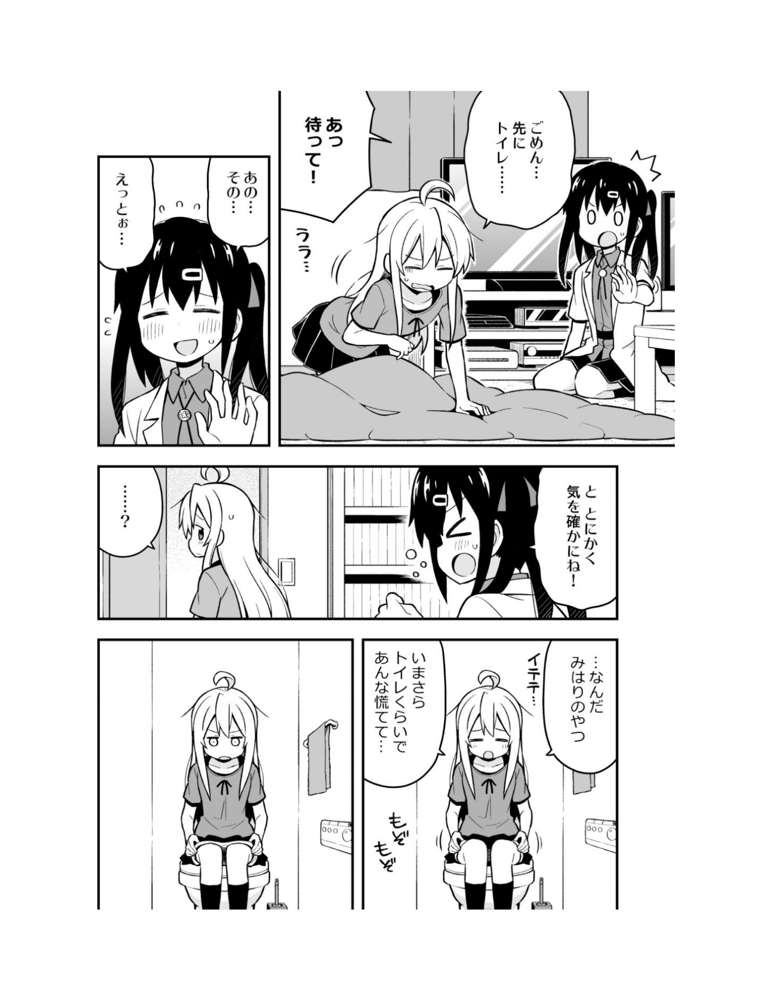
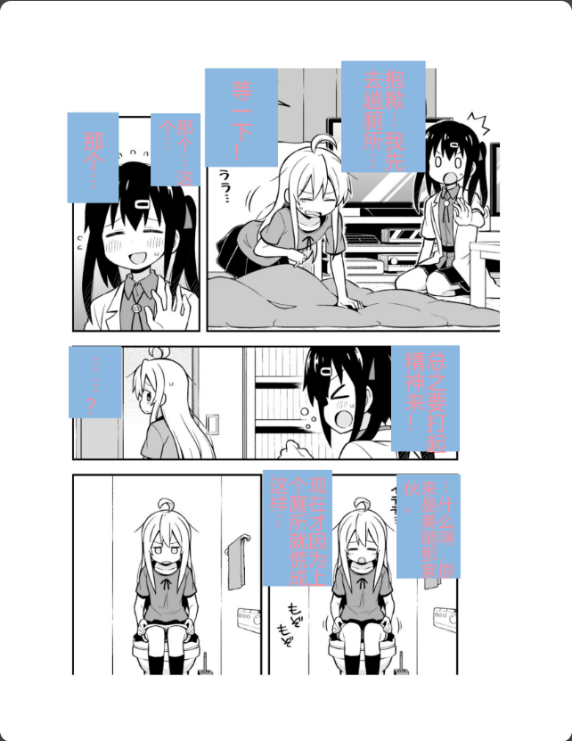
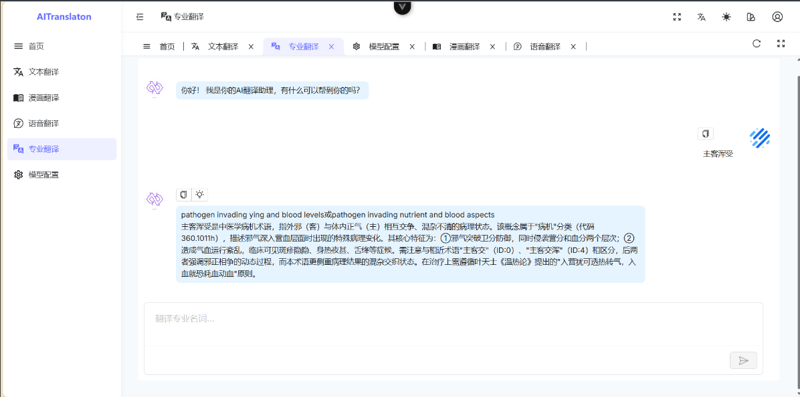
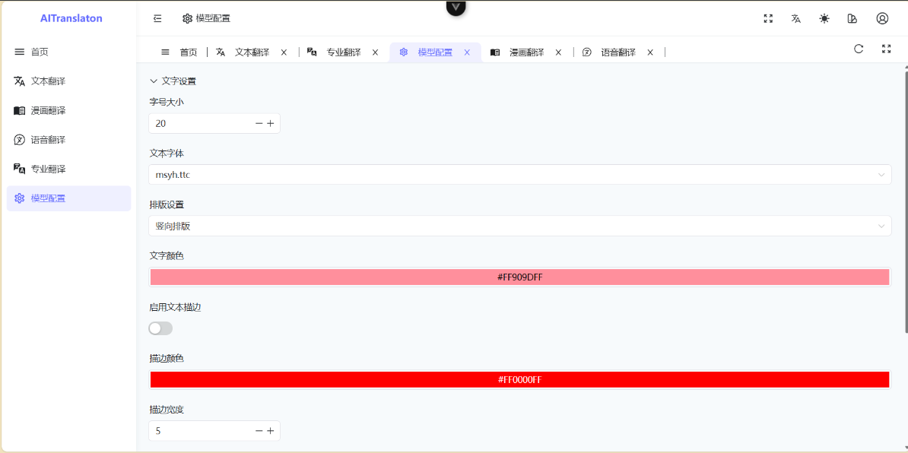

# AI翻译助手项目


---

## 漫画气泡框识别
使用Manga109数据集在Yolov12和RT-DETR上分别做迁移训练,实验结果：



### 数据处理

代码位于/Text-box-recogniton/data-process/data_process(text).ipynb

在运行处理脚本之前，请确保你已经下载了 Manga109 数据集，并按如下结构组织文件。脚本需要读取 annotations 目录下的 XML 文件、books.txt 文件。

Manga109数据集官网：http://www.manga109.org/
需要到https://huggingface.co/datasets/hal-utokyo/Manga109

申请，需要使用带edu后缀邮箱注册的huggingface账号申请

```
Manga109/
├── annotations/
│   ├── Akuhamu.xml
│   ├── Amagami.xml
│   └── ... (所有漫画的XML标注文件)
├── images/
│   ├── Akuhamu/
│   │   ├── 000.jpg
│   │   └── ...
│   └── ... (所有漫画的图片)
├── books.txt          (包含109本漫画标题的列表)
└── prepare_data.py    <-- (你的数据处理脚本)
```

数据处理脚本 (prepare_data.py) 主要执行以下四个步骤：

1. **读取漫画标题列表**
   - 脚本首先从 books.txt 文件中读取所有109本漫画的官方标题。
2. **划分数据集**
   - 为了保证实验的可复现性，脚本使用固定的随机种子 (seed=42) 对漫画标题列表进行洗牌。
   - 然后，它按照 **书本级别** 将数据集划分为训练集、验证集和测试集，比例大致为 **84 (训练) : 5 (验证) : 10 (测试)**。
   - 按书本划分可以有效防止同一本书的页面同时出现在训练集和验证/测试集中，避免数据泄露。
3. **解析XML并转换为COCO格式**
   - 脚本会遍历划分好的标题列表，并找到对应的XML标注文件。
   - 对于每本书的每一页，它会解析XML文件，但 **仅提取类别为 text 的标注框**。其他如 body, face 等类型的标注会被忽略。
   - 它将每个文本框的坐标 (xmin, ymin, xmax, ymax) 转换为 COCO 数据集标准格式 ([x, y, width, height])。
   - 同时，它会记录每张图片的元信息，如文件名 (书名/页码.jpg)、宽度和高度。
4. **保存为JSON文件**
   - 最后，脚本将为训练集、验证集和测试集分别生成三个独立的 json 文件。这些文件完全遵循 COCO 格式，可以直接用于后续的模型训练和评估。
   - 使用/Text-box-recogniton/data-process/coco2yolov.ipynb将coco格式的数据集转成yolov格式

## 项目技术栈

### 前端

Vue3+Ts

前端模板：[soybeanjs/soybean-admin: A clean, elegant, beautiful and powerful admin template, based on Vue3, Vite7, TypeScript, Pinia, NaiveUI and UnoCSS. 一个清新优雅、高颜值且功能强大的后台管理模板，基于最新的前端技术栈，包括 Vue3, Vite7, TypeScript, Pinia, NaiveUI 和 UnoCSS。](https://github.com/soybeanjs/soybean-admin/)

### 后端

Django+sqlite


## 主要页面

















@article{multimedia_aizawa_2020,
    author={Kiyoharu Aizawa and Azuma Fujimoto and Atsushi Otsubo and Toru Ogawa and Yusuke Matsui and Koki Tsubota and Hikaru Ikuta},
    title={Building a Manga Dataset ``Manga109'' with Annotations for Multimedia Applications},
    journal={IEEE MultiMedia},
    volume={27},
    number={2},
    pages={8--18},
    doi={10.1109/mmul.2020.2987895},
    year={2020}
}
@article{mtap_matsui_2017,
    author={Yusuke Matsui and Kota Ito and Yuji Aramaki and Azuma Fujimoto and Toru Ogawa and Toshihiko Yamasaki and Kiyoharu Aizawa},
    title={Sketch-based Manga Retrieval using Manga109 Dataset},
    journal={Multimedia Tools and Applications},
    volume={76},
    number={20},
    pages={21811--21838},
    doi={10.1007/s11042-016-4020-z},
    year={2017}
}


