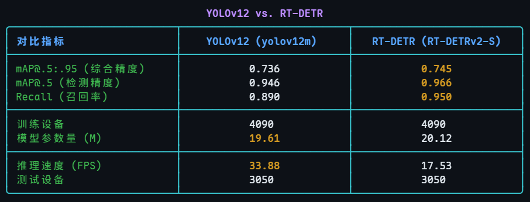

---

## **一个基于大语言模型与计算机视觉的端到端漫画翻译系统**

### **摘要**

漫画的数字化翻译（Scanlation）流程复杂且劳动密集。为实现该流程的高度自动化，本项目设计并实现了一个集成的、端到端的AI翻译辅助系统。该系统的核心是一个多阶段处理管线，依次执行**文本气泡检测**、**光学字符识别（OCR）**、**文本擦除（Inpainting）**、**大语言模型翻译**与**智能排版**。在关键的文本气泡检测环节，本研究利用Manga109数据集对YOLOv12与RT-DETR模型进行迁移学习，实验表明YOLOv12模型在精度和速度上都表现卓越，为后续处理的准确性奠定了坚实基础。翻译模块集成了先进的大语言模型API，以确保译文的流畅性与上下文准确性。最终，我们通过一个前后端分离的Web应用，成功验证了整个自动化翻译管线的有效性，将传统上需要数小时的人工操作缩短至数分钟。

### **1. 引言**

随着全球文化交流的加深，漫画（Manga）在全球范围内广受欢迎。然而，传统的翻译流程（Scanlation）涉及多个手动步骤：定位文本气泡、擦除原文、翻译文本、最后再将译文重新排版填入，整个过程耗时且繁琐。这些瓶颈严重限制了漫画作品的传播速度和范围。

为解决此问题，本项目旨在利用最新的AI技术，构建一个**从原始漫画图像到最终翻译成品的端到端自动化系统**。通过将多个计算机视觉模型与大语言模型（LLM）串联成一个无缝的工作流，我们旨在最大限度地减少人工干预，显著提升翻译效率和质量。

### **2. 研究方法**

#### **2.1 系统整体架构**
本系统采用前后端分离的B/S架构，确保了灵活性和可扩展性。
*   **前端**：基于Vue3、Vite7、TypeScript、NaiveUI等现代化技术栈，并采用`soybean-admin`模板进行开发。负责用户交互、漫画上传、任务管理以及最终翻译结果的可视化呈现。
*   **后端**：基于Django框架，使用SQLite数据库。作为系统的核心引擎，它负责调度和执行整个AI处理管线，并向前端提供API服务。

#### **2.2 数据集与预处理**
**2.2.1 数据集来源**
本研究采用Manga109数据集[1, 2]，这是一个专为多媒体应用构建的大规模漫画图像数据集，包含109部漫画作品及其详细的XML格式标注。

**2.2.2 数据预处理流程**
为了将原始数据转化为适用于模型训练的格式，我们设计了严谨的预处理流程：
1.  **数据集划分**：以**书本为单位**对109部漫画进行划分，采用固定的随机种子（seed=42），将数据集按约84:5:10的比例划分为训练集、验证集和测试集。
2.  **标注信息提取与转换**：我们解析XML标注文件，**仅提取类别为`text`的标注框**，并将其坐标转换为COCO数据集的标准格式。
3.  **格式化存储**：最终，将处理后的数据分别保存为训练、验证、测试三个独立的JSON文件，为后续模型训练做好准备。

#### **2.3 端到端自动化翻译管线**
当用户上传一张漫画图像后，后端会启动一个自动化的处理管线，该管线包含以下五个核心阶段：
1.  **阶段一：文本气泡检测 (Detection)**：使用RT-DETR模型高精度定位所有文本气泡框。
2.  **阶段二：文本识别 (OCR)**：对检测到的气泡区域进行裁剪并送入OCR引擎，提取日文原文。
3.  **阶段三：大语言模型翻译 (LLM Translation)**：调用外部大语言模型（如GPT系列、Claude等）的API接口，将提取的原文翻译成目标语言。利用LLM的强大上下文理解能力，确保翻译结果的准确性和自然度。
4.  **阶段四：文本擦除与重绘 (Inpainting)**：并行地，使用图像修复算法擦除原始文本，并无缝重建背景。
5.  **阶段五：智能排版 (Typesetting)**：将翻译好的文本，根据其长度和气泡框形状，自动进行排版并渲染到擦除后的区域。

### **3. 实验结果与分析**

#### **3.1 文本气泡检测模型性能**
检测模型的性能是整个管线成功的基石。我们在Manga109测试集上对YOLOv12和RT-DETR模型进行了定量评估，结果如图1所示。

*图1：YOLOv12与RT-DETR在Manga109测试集上的性能比较*

从数据中可以观察到，RT-DETR在各项精度指标（mAP@.5:.95, mAP@.5, Recall）上均略优于YOLOv12。然而，**YOLOv12的推理速度（33.88 FPS）几乎是RT-DETR（17.53 FPS）的两倍**。

对于一个面向用户的Web应用而言，响应速度至关重要。考虑到YOLOv12的mAP@.5精度已高达0.946，完全满足本应用场景下的高精度要求，其显著的速度优势使得它成为更合适的选择。因此，**我们最终选择YOLOv12作为系统的核心检测模型，因为它在保证了极高检测精度的同时，提供了卓越的实时处理能力，为用户带来了更流畅的体验**。

#### **3.2 系统功能与用户工作流展示**
我们基于性能更优的RT-DETR模型和完整的翻译管线，开发了全功能的Web应用原型。以下将展示用户从登录到获取最终翻译成品的全过程。

**第一步：用户认证与系统访问**
用户首先通过设计简洁的登录界面（图2）进行身份认证，成功后进入系统主仪表盘（图3），仪表盘提供了系统概览和功能导航。

|  |  |
| :--------------------------------------------------------: | :--------------------------------------------------------: |
|                    *图2：系统登录界面*                     |                    *图3：系统主仪表盘*                     |

**第二步：任务创建与文件上传**
用户在核心功能区可以创建新的翻译任务。系统提供了清晰的界面引导用户上传单张或多张漫画图片（图4、图5、图6），并启动自动化处理流程。

|  |  |  |
| :----------------------------------------------------------: | :--------------------------------------------------------: | :--------------------------------------------------------: |
|                   *图4：翻译任务管理界面*                    |                    *图5：文件上传界面*                     |                    *图6：上传进度展示*                     |

**第三步：自动化处理与结果可视化**
后端接收到任务后，自动执行五阶段翻译管线。首先，RT-DETR模型会精确地检测出所有文本气泡框，如图7所示。

*图7：文本气泡检测结果可视化示例*

随后，系统完成后续的OCR、翻译、擦除和排版步骤。最终结果将以丰富的形式呈现给用户。用户可以查看带有最终译文的成品漫画（图8），也可以进入详细的对照与校对视图（图9、图10），该视图并列展示了原始文本、大模型翻译文本以及排版效果，极大地便利了人工审核与微调。

|  |  |
| :----------------------------------------------------------: | :----------------------------------------------------------: |
|                   *图8：最终翻译成品展示*                    |               *图9：原文与译文的详细对照视图*                |

*图10：系统提供原文和译文以供快速校对*

### **4. 结论与未来展望**

本研究成功地构建并验证了一个基于大语言模型与计算机视觉的端到端漫画翻译系统。通过整合高性能的文本气泡检测、OCR、大模型翻译、图像修复和智能排版技术，我们创建了一个高度自动化的处理管线。实验证明，该系统能够有效地将原始漫画页面转化为翻译成品，显著降低了人工翻译流程中的技术壁垒和时间成本。

未来的工作将聚焦于以下几个方面：
1.  **处理特殊文本（音效词）**：开发专门用于识别和翻译拟声词、音效词（SFX）的模型。这类文本通常具有高度艺术化的字体和不规则的排列，是当前系统的主要挑战。
2.  **引入人机协同校对**：在Web界面中开发更强大的交互式编辑工具，允许用户方便地修正OCR识别错误、润色翻译结果或调整自动排版，实现“AI为主，人工为辅”的高效协同模式。
4.  **多语言支持与模型泛化**：扩展系统对更多目标语言的支持，并通过在更多样化的漫画风格数据集上进行训练，增强整个管线对不同画风的泛化能力。

### **5. 参考文献**
[1] Aizawa, K., Fujimoto, A., Otsubo, A., Ogawa, T., Matsui, Y., Tsubota, K., & Ikuta, H. (2020). Building a Manga Dataset “Manga109” with Annotations for Multimedia Applications. *IEEE MultiMedia*, 27(2), 8–18.

[2] Matsui, Y., Ito, K., Aramaki, Y., Fujimoto, A., Ogawa, T., Yamasaki, T., & Aizawa, K. (2017). Sketch-based Manga Retrieval using Manga109 Dataset. *Multimedia Tools and Applications*, 76(20), 21811–21838.

@article{multimedia_aizawa_2020,
    author={Kiyoharu Aizawa and Azuma Fujimoto and Atsushi Otsubo and Toru Ogawa and Yusuke Matsui and Koki Tsubota and Hikaru Ikuta},
    title={Building a Manga Dataset ``Manga109'' with Annotations for Multimedia Applications},
    journal={IEEE MultiMedia},
    volume={27},
    number={2},
    pages={8--18},
    doi={10.1109/mmul.2020.2987895},
    year={2020}
}
@article{mtap_matsui_2017,
    author={Yusuke Matsui and Kota Ito and Yuji Aramaki and Azuma Fujimoto and Toru Ogawa and Toshihiko Yamasaki and Kiyoharu Aizawa},
    title={Sketch-based Manga Retrieval using Manga109 Dataset},
    journal={Multimedia Tools and Applications},
    volume={76},
    number={20},
    pages={21811--21838},
    doi={10.1007/s11042-016-4020-z},
    year={2017}
}

